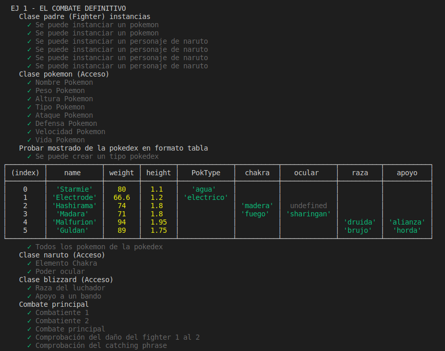
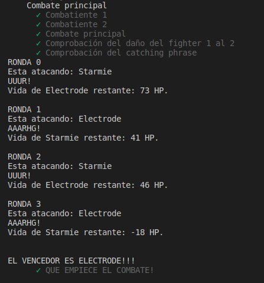
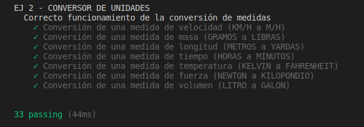

# Informe. Práctica 6: Clases genéricas e interfaces.
## Desarrollo de Sistemas Informáticos.
#### ADRIAN HERNANDEZ SUAREZ - alu0101235516@ull.edu.es


### _**Introducción.**_

  Para llevar a cabo este informe, hemos tenido que realizar 3 ejercicios diferentes acerca de la utilización de clases genéricas e interfaces. Cada ejercico es diferente a otro y con eso hemos conseguido mayor diversidad y mayor conocimiento acerca de diferentes áreas del **TypeScript**. Además de comenzar con los principios SOLID, agregar Instanbul y el uso de Coveralls.

### _**Objetivos.**_

  El objetivo de esta práctica es resolver una serie de ejercicios de programación que nos permitirán conocer más en profundidad, toda la utilización y la mayor eficacia que te dan las clases y las interfaces para la realización de las funciones en **TypeScript**.

### _**Primer paso: Creación de los directorios de trabajo**_

  Para completar este primer apartado, tendremos que seguir los pasos que se muestran en el siguiente enlace [Creación de un proyecto inicial para trabajar con TypeScript](https://ull-esit-inf-dsi-2021.github.io/typescript-theory/typescript-project-setup.html) con esto lo que conseguiremos será crear un espacio de trabajo ideal para comenzar con el desarrollo de los ejercicios propuestos.
  Cuando tengamos esta parte realizada, tendremos creado un directorio llamado `./src`, en este directorio es donde alojaremos todos los ejercicios que vayamos haciendo, cada uno en un fichero independiente con la siguiente notación `ejercicio-n.ts`.
  
### _**Segundo paso: Instalación de mocha y chai. Instanbul y Coveralls. Además de la configuración de TypeDoc**_
  
  Una vez tengamos hecho el primer paso de esta práctica tendremos que hacer la instalación de TypeDoc, esto es un generador automático de documentación para proyectos de **TypeScript**.  Para conocer mejor esto y seguir la instalación y configuración correctamente, mire el siguiente enlace [Instalación y Configuración de TypeDoc](https://drive.google.com/file/d/19LLLCuWg7u0TjjKz9q8ZhOXgbrKtPUme/view). 
  Cuando tengamos la documentación creada, tendremos que proceder a la instalación de `Mocha` y de `Chai`. Para conocer mejor su funcionamiento y ver la correcta pauta de instalación, siga el siguiente enlace [Instalación y Configuración de Mocha y Chai](https://drive.google.com/file/d/1-z1oNOZP70WBDyhaaUijjHvFtqd6eAmJ/view).
  
  Una vez tengamos toda la instalación previa, tendremos que instalar Instabull y conocer el uso de Coveralls, para ello podemos seguir los pasos en el siguiente enlace [Instalación y Configuración de Instanbull y Coveralls](https://drive.google.com/file/d/1xLDc4CpoYpsAlCFO_4DMwu7MKCtcZDnh/view).
  
  Cuando tengamos todo esto listo, lo que conseguiremos es hacer un TDD del proyecto, es decir, las pruebas unitarias. Utilizando el comando `npm test` podremos ejecutar dichas pruebas, viendo si la función que hemos creado, es correcta o no. Para dar validez y constancia de esto, tendremos que hacer un commit antes de la realización del código y con el test hecho, viendo como falla dicho test, y luego tendremos que hacer otro commit después de la correcta realización del código para dar constancia de que esta bien realizado.

### _**Tercer paso: Realizar los ejercicios propuestos**_
### Ejercicio 1 - El combate definitivo.

  **Enunciado a realizar**

Partiendo del desarrollo realizado para el Ejercicio 1 de la Práctica 5, supongamos que ahora queremos incluir distintos tipos de contendientes a la pelea. Por ejemplo, podríamos incluir personajes del universo Marvel, DC Comics, Star Wars o Dragon Ball entre otros. Puede incluir otros universos y/o personajes que desee. Para extender el desarrollo anterior se pide:

  - Desarrolle una clase abstracta llamada Fighter que permita hacer que un contendiente pueda luchar. Esta clase se considerará la superclase del resto de clases a implementar. Para cada universo, desarrolle la clase que lo represente (Pokemon, Marvel, DC, Star Wars, Dragon Ball, etc).

  - Cada contendiente debe ser descendiente de su clase universo. Además, para cada contendiente se debe poder acceder a la información requerida para la clase Pokemon de la práctica anterior (nombre, altura, peso, etc). Puede incluir información extra que considere oportuna según el universo.
 
  - La clase Combat ahora permitará que los combates se disputen entre contendientes de distintos universos. Todas las combinaciones deben ser posibles, incluso contendientes del mismo universo. Asimismo, la simulación de los combates debe ser similar a la realizada en la práctica anterior. Sin embargo, ahora con cada ataque los contendientes deberán mostrar alguna catching phrase representativa de su personaje.
 
  - Actualice los valores de efectividad de los movimientos de los nuevos contendientes de la forma que considere oportuna. Contendientes de un universo son más fuertes que los de otro, personajes concretos son más fuertes que otros sin importar el universo o una mezcla de ambas. Puede basarse en un criterio similar al empleado en las prácticas anteriores sobre los tipos de Pokemon.
 
  - La clase Pokedex deberá actualizarse para incluir también el resto de contendientes. Esto es, deberá ser capaz de almacenar personajes de todos los universos considerados dentro de una misma estructura de datos. Además, deberá ofrecer todas las funcionalidades previamente requeridas para los nuevos contendientes.
Por último, desarrolle este ejercicio empleando los principios SOLID Single Responsability y Open-Closed.

El ejercicio lo tenemos dividido en diferentes clases, por lo que tendremos diferentes archivos en nuestro `src` del ejercicio 1. Cada clase se crea en base a cada universo diferentes, la clase para el combate, y la clase para la recopilación de todos los luchadores. Comencemos a verlas una por una, pero empezando por la clase padre.

  **La clase Fighter (padre)**

```TypeScript
export abstract class Fighter {
  protected stats = {
    AT: 0,
    DF: 0,
    SP: 0,
    HP: 0,
  }

  /**
   * Constructor de la clase
   * @param name nombre del fighter
   * @param weight peso del fighter
   * @param height altura del fighter
   * @param phrase frase célebre del fighter
   * @param stats estadísticas del fighter
   */

  constructor(protected name: string,
              protected weight: number,
              protected height: number,
              protected phrase: string,
              stats: [number, number, number, number]) {
    this.stats.AT = stats[0];
    this.stats.DF = stats[1];
    this.stats.SP = stats[2];
    this.stats.HP = stats[3];
  }

  /**
   * Funcion para obtener el nombre del fighter
   * @returns el nombre del fighter
   */
  public getName() {
    return this.name;
  }
  /**
   * Funcion para instanciar un nuevo nombre
   * @param name nombre nuevo
   */
  public setName(name: string) {
    this.name = name;
  }

  /**
   * Funcion para obtener el peso del fighter
   * @returns el peso del fighter
   */
  public getWeight() {
    return this.weight;
  }
  /**
   * Funcion para instanciar un nuevo peso
   * @param name peso nuevo
   */
  public setWeight(weight: number) {
    this.weight = weight;
  }

  /**
   * Funcion para obtener la altura del fighter
   * @returns la altura del fighter
   */
  public getHeight() {
    return this.height;
  }
  /**
   * Funcion para instanciar una nueva altura
   * @param name altura nueva
   */
  public setHeight(height: number) {
    this.height = height;
  }

  /**
   * Funcion para obtener la frase célebre del fighter
   * @returns frase célebre del fighter
   */
  public getPhrase() {
    return this.phrase;
  }
  /**
   * Funcion para instanciar una nueva frase célebre
   * @param name frase célebre nueva
   */
  public setPhrase(phrase: string) {
    this.phrase = phrase;
  }

  /**
   * Funcion para obtener el ataque del fighter
   * @returns el ataque del fighter
   */
  public getAT() {
    return this.stats.AT;
  }
  /**
   * Funcion para instanciar un nuevo ataque
   * @param name ataque nuevo
   */
  public setAT(AT: number) {
    this.stats.AT = AT;
  }

  /**
   * Funcion para obtener la defensa del fighter
   * @returns la defensa del fighter
   */
  public getDF() {
    return this.stats.DF;
  }
  /**
   * Funcion para instanciar una nueva defensa
   * @param name defensa nueva
   */
  public setDF(DF: number) {
    this.stats.DF = DF;
  }

  /**
   * Funcion para obtener la velocidad del fighter
   * @returns la velocidad del fighter
   */
  public getSP() {
    return this.stats.SP;
  }
  /**
   * Funcion para instanciar una nueva velocidad
   * @param name velocidad nueva
   */
  public setSP(SP: number) {
    this.stats.SP = SP;
  }

  /**
   * Funcion para obtener la vida del fighter
   * @returns la vida del fighter
   */
  public getHP() {
    return this.stats.HP;
  }
  /**
   * Funcion para instanciar una nueva vida
   * @param name vida nueva
   */
  public setHP(HP: number) {
    this.stats.HP = HP;
  }

  /**
   * Funcion para obtener el universo del que pertenece el fighter
   * @returns el universo del fighter
   */
  public abstract getUniverse(): string;
}
```
  La clase `fighter` es la clase padre de este ejercicio, dicha clase es de tipo abstracto, el cual contiene los atributos básicos de los luchadores que van a competir en nuestro combate. A parte de tener dicho constrcutor con el nombre, la altura, el peso, y las estadísticas básicas, tendremos los `getters` y `setters` de cada una de ellas, además de una función llamada `getUniverse()` la cual la usaremos para ver a que universo pertence nuestro luchador.

  **La clase Pokemon**
  
```TypeScript
import {Fighter} from './fighter';

type poktype = 'hierba' | 'electrico' | 'fuego' | 'agua';

export class Pokemon extends Fighter {
  private universePH: string = "Pokemon";

  /**
   * Constructor de la clase
   * @param name nombre del fighter
   * @param weight peso del fighter
   * @param height altura del fighter
   * @param phrase frase célebre del fighter
   * @param stats estadísticas del fighter
   * @param PokType tipo de pokemon que es
   */

  constructor(name: string, weight: number, height: number, phrase: string, stats: [number, number, number, number],
              private PokType: poktype) {
    super(name, weight, height, phrase, stats);
  }

  /**
   * Funcion para obtener el tipo de pokemon
   * @returns el tipo de pokemon que es
   */
  public getPokType() {
    return this.PokType;
  }
  /**
   * Instanciar un nuevo tipo a un pokemon
   * @param PokType el tipo que quieres instanciar
   */
  public setPokType(PokType: poktype) {
    this.PokType = PokType;
  }

  /**
   * Funcion para obtener el universo del que pertenece el fighter
   * @returns el universo del fighter
   */
  public getUniverse(): string {
    return this.universePH;
  }
}
```
  La clase `Pokemon` la utilizamos para poder crear un objeto de tipo `Pokemon` que tenga diferentes atributos, desde nuestro constructor recibiremos, el nombre del pokemon, el peso, la altura, el tipo, y finalmente las estadísticas básicas, que son (el ataque, la defensa, la velocidad, y la vida maxima). 
  Por otro lado tenemos los métodos `getters` de cada uno de los atributos del constructor que sean propios de esta clase, el cual nos servirá para poder acceder a cada uno de ellos y además hemos creado, los `setter` de cada atributo.
  
**la clase Naruto**

```TypeScript
import {Fighter} from './fighter';

type chakraType = 'rayo' | 'viento' | 'fuego' | 'agua' | 'tierra' | 'madera';
type ocularTec = 'sharingan' | 'byakugan' | 'rinnegan' | 'tenseigan';

export class Naruto extends Fighter {
  private universePH: string = "Naruto";

  /**
   * Constructor de la clase
   * @param name nombre del fighter
   * @param weight peso del fighter
   * @param height altura del fighter
   * @param phrase frase célebre del fighter
   * @param stats estadísticas del fighter
   * @param chakra tipo de chakra del fighter
   * @param ocular poder ocular (o no) del fighter
   */

  constructor(name: string, weight: number, height: number, phrase: string, stats: [number, number, number, number],
              private chakra: chakraType,
              private ocular?: ocularTec) {
    super(name, weight, height, phrase, stats);
  }

  /**
   * Funcion para acceder al chakra del fighter
   * @returns el tipo de chakra
   */
  public getChakra() {
    return this.chakra;
  }
  /**
   * Funcion para instanciar un chakra nuevo a un fighter
   * @param chakra el tipo de chakra a instanciar
   */
  public setChakra(chakra: chakraType) {
    this.chakra = chakra;
  }

  /**
   * Funcion para acceder al poder ocular del fighter
   * @returns el tipo de poder ocular
   */
  public getOcular() {
    return this.ocular;
  }
  /**
   * Funcion para instanciar un poder ocular nuevo a un fighter
   * @param chakra el tipo de poder ocular a instanciar
   */
  public setOcular(ocular: ocularTec) {
    this.ocular = ocular;
  }

  /**
   * Funcion para obtener el universo del que pertenece el fighter
   * @returns el universo del fighter
   */
  public getUniverse(): string {
    return this.universePH;
  }
}
```
  La clase `Naruto` la utilizamos para poder crear un objeto de tipo `Naruto` que tenga diferentes atributos, desde nuestro constructor recibiremos, el nombre del personaje, el peso, la altura, el tipo de chakra, el poder ocular (si tiene), y finalmente las estadísticas básicas, que son (el ataque, la defensa, la velocidad, y la vida maxima). 
  Por otro lado tenemos los métodos `getters` de cada uno de los atributos del constructor que sean propios de esta clase, el cual nos servirá para poder acceder a cada uno de ellos y además hemos creado, los `setter` de cada atributo.
  
**La clase Blizzard**

```TypeScript
import {Fighter} from './fighter';

type chakraType = 'mago' | 'brujo' | 'cazador' | 'druida';
type tipapoyo = 'alianza' | 'horda';

export class Blizzard extends Fighter {
  private universePH: string = "Blizzard";

  /**
   * Constructor de la clase
   * @param name nombre del fighter
   * @param weight peso del fighter
   * @param height altura del fighter
   * @param phrase frase célebre del fighter
   * @param stats estadísticas del fighter
   * @param raza raza del fighter
   * @param apoyo a que bando apoya el fighter
   */

  constructor(name: string, weight: number, height: number, phrase: string, stats: [number, number, number, number],
              private raza: chakraType,
              private apoyo: tipapoyo) {
    super(name, weight, height, phrase, stats);
  }

  /**
   * Funcion para acceder a la raza
   * @returns raza del fighter
   */
  public getRaza() {
    return this.raza;
  }
  /**
   * Funcion para instanciar una raza a un fighter
   * @param raza tipo de raza que quieres instanciar
   */
  public setRaza(raza: chakraType) {
    this.raza = raza;
  }

  /**
   * Funcion para acceder a l bando que apoya
   * @returns bando que apoya el fighter
   */
  public getApoyo() {
    return this.apoyo;
  }
  /**
   * Funcion para instanciar el bando a un fighter
   * @param apoyo bando que quiere apoyar
   */
  public setApoyo(apoyo: tipapoyo) {
    this.apoyo = apoyo;
  }

  /**
   * Funcion para obtener el universo del que pertenece el fighter
   * @returns el universo del fighter
   */
  public getUniverse(): string {
    return this.universePH;
  }
}
```
  La clase `Blizzard` la utilizamos para poder crear un objeto de tipo `Blizzard` que tenga diferentes atributos, desde nuestro constructor recibiremos, el nombre del personaje, el peso, la altura, su raza, el bando que apoya, y finalmente las estadísticas básicas, que son (el ataque, la defensa, la velocidad, y la vida maxima). 
  Por otro lado tenemos los métodos `getters` de cada uno de los atributos del constructor que sean propios de esta clase, el cual nos servirá para poder acceder a cada uno de ellos y además hemos creado, los `setter` de cada atributo.
  
**La clase FightBook**
  
```TypeScript
import {Fighter} from './fighter';

/**
 * Clase fight book contiene todos los luchadores.
 */
export class FightBook {
  /**
   * Constructor de la clase
   * @param GestorFighter Conjunto de luchadores
   */

  constructor(private GestorFighter: Fighter[]) {}

  /**
   * Funcion para acceder a la variable privada GestorFighter
   * @returns los luchadores que tenemos guardados
   */

  public getFighters() {
    return this.GestorFighter;
  }

  /**
   * Funcion para añadir un luchadores a la base de datos
   * @param luchadores nuevo luchadores que quieres añadir
   */

  public añadirFighter(fighter: Fighter) {
    this.GestorFighter.push(fighter);
  }

  /**
   * Funcion para mostrar por pantalla en forma de tabla la fight book
   */

  public mostrarFighterBook() {
    console.table(this.GestorFighter, ["name", "weight", "height", "PokType", "chakra", "ocular", "raza", "apoyo"]);
  }
}
```
  La clase `FightBook` nos sirve para almacenar todos los luchadores en un sitio, es decir, a esta clase, le podremos introducir un objeto de tipo `Pokemon`, `Naruto` o `Blizzard` el cual se quedará almacenado en nuestro **Libro de Luchadores**. Lo que tendrá el constructor de esta clase será un vector, el cual almacenará a todos los luchadores, pudiendo acceder a ellos o añadir otro a la base de datos.
  Tenemos el método `getFighters()` el cual retornará los luchadores que tenemos guardado dentro de ella, el método `añadirFighter()` el cual sirve (como nombre antes) para añadir un nuevo luchador al libro.
  Y finalmente tenemos la función `mostrarFighterBook()` la cual nos sirve para mostrar en forma de tabla, los luchadores dentro del libro con sus estadísticas, en este caso he decidido únicamente mostrar el nombre, el peso, la altura, la raza, el poder ocular y el tipo de pokemon que es.
  
  **La clase Combat**
  
```TypeScript
import {Fighter} from './fighter';
import {Naruto} from './naruto';
import {Pokemon} from './pokemon';

export class Combat {
  /**
   * COnstructor de la clase
   * @param fighter1 Primer luchador
   * @param fighter2 Segundo luchador
   */
  constructor(private fighter1: Fighter, private fighter2: Fighter) {
  }

  /**
   * Funcion para acceder a los datos del luchador 1
   * @returns los datos del luchador 1
   */
  public getFighter1() {
    return this.fighter1;
  }
  /**
   * Funcion para acceder a los datos del luchador 2
   * @returns los datos del luchador 2
   */
  public getFighter2() {
    return this.fighter2;
  }

  /**
   * Funcion para ver entre quien es el combate
   * @returns Una string con la informacion del combate
   */
  public getCombate() {
    return (`El combate es entre ${this.fighter1.getName()} y ${this.fighter2.getName()}`);
  }

  /**
   * Funcion para calcular el daño de cada luchador
   * @param FighterAttack que luchador esta atacando
   * @returns el daño que hace el luchador que esta atacando
   */
  public damageGet(FighterAttack: number) {
    let efectFighter1: number = 0;
    let efectFighter2: number = 0;
    let daño: number = 0;
    let dañoInt: number = 0;

    switch (this.fighter1.getUniverse()) {
      case "Pokemon": {
        if (this.fighter2.getUniverse() == "Blizzard") {
          efectFighter1 = 2;
          efectFighter2 = 0.5;
        } else if (this.fighter2.getUniverse() == "Naruto") {
          efectFighter1 = 0.5;
          efectFighter2 = 2;
        } else {
          if (this.fighter1 instanceof Pokemon && this.fighter2 instanceof Pokemon) {
            switch (this.fighter1.getPokType()) {
              case `fuego`: {
                if (this.fighter2.getPokType() == `hierba`) {
                  efectFighter1 = 2;
                  efectFighter2 = 0.5;
                } else if (this.fighter2.getPokType() == `agua` || this.fighter2.getPokType() == `fuego`) {
                  efectFighter1 = 0.5;
                  efectFighter2 = 2;
                } else {
                  efectFighter1 = 1;
                  efectFighter2 = 1;
                }
              } break;

              case `agua`: {
                if (this.fighter2.getPokType() == `fuego`) {
                  efectFighter1 = 2;
                  efectFighter2 = 0.5;
                } else {
                  efectFighter1 = 0.5;
                  efectFighter2 = 2;
                }
              } break;

              case `hierba`: {
                if (this.fighter2.getPokType() == `agua`) {
                  efectFighter1 = 2;
                  efectFighter2 = 0.5;
                } else if (this.fighter2.getPokType() == `fuego` || this.fighter2.getPokType() == `hierba`) {
                  efectFighter1 = 0.5;
                  efectFighter2 = 2;
                } else {
                  efectFighter1 = 1;
                  efectFighter2 = 1;
                }
              } break;

              case `electrico`: {
                if (this.fighter2.getPokType() == `agua`) {
                  efectFighter1 = 2;
                  efectFighter2 = 0.5;
                } else if (this.fighter2.getPokType() == `electrico`) {
                  efectFighter1 = 0.5;
                  efectFighter2 = 2;
                } else {
                  efectFighter1 = 1;
                  efectFighter2 = 1;
                }
              }
            }
          }
        }
      } break;

      case "Naruto": {
        if (this.fighter2.getUniverse() == "Pokemon") {
          efectFighter1 = 2;
          efectFighter2 = 0.5;
        } else if (this.fighter2.getUniverse() == "Blizzard") {
          efectFighter1 = 0.5;
          efectFighter2 = 2;
        } else {
          if (this.fighter1 instanceof Naruto && this.fighter2 instanceof Naruto) {
            switch (this.fighter1.getChakra()) {
              case `rayo`: {
                if (this.fighter2.getChakra() == `viento` || this.fighter2.getChakra() == `agua`) {
                  efectFighter1 = 2;
                  efectFighter2 = 0.5;
                } else if (this.fighter2.getChakra() == `madera` || this.fighter2.getChakra() == `fuego`) {
                  efectFighter1 = 0.5;
                  efectFighter2 = 2;
                } else {
                  efectFighter1 = 1;
                  efectFighter2 = 1;
                }
              } break;

              case `viento`: {
                if (this.fighter2.getChakra() == `fuego` || this.fighter2.getChakra() == `tierra`) {
                  efectFighter1 = 2;
                  efectFighter2 = 0.5;
                } else if (this.fighter2.getChakra() == `madera` || this.fighter2.getChakra() == `rayo`) {
                  efectFighter1 = 0.5;
                  efectFighter2 = 2;
                } else {
                  efectFighter1 = 1;
                  efectFighter2 = 1;
                }
              } break;

              case `fuego`: {
                if (this.fighter2.getChakra() == `madera` || this.fighter2.getChakra() == `rayo`) {
                  efectFighter1 = 2;
                  efectFighter2 = 0.5;
                } else if (this.fighter2.getChakra() == `viento` || this.fighter2.getChakra() == `agua`) {
                  efectFighter1 = 0.5;
                  efectFighter2 = 2;
                } else {
                  efectFighter1 = 1;
                  efectFighter2 = 1;
                }
              } break;

              case `agua`: {
                if (this.fighter2.getChakra() == `fuego`) {
                  efectFighter1 = 2;
                  efectFighter2 = 0.5;
                } else if (this.fighter2.getChakra() == `rayo` || this.fighter2.getChakra() == `tierra`) {
                  efectFighter1 = 0.5;
                  efectFighter2 = 2;
                } else {
                  efectFighter1 = 1;
                  efectFighter2 = 1;
                }
              }

              case `tierra`: {
                if (this.fighter2.getChakra() == `agua`) {
                  efectFighter1 = 2;
                  efectFighter2 = 0.5;
                } else if (this.fighter2.getChakra() == `viento`) {
                  efectFighter1 = 0.5;
                  efectFighter2 = 2;
                } else {
                  efectFighter1 = 1;
                  efectFighter2 = 1;
                }
              }

              case `madera`: {
                if (this.fighter2.getChakra() == `viento` || this.fighter2.getChakra() == `rayo`) {
                  efectFighter1 = 2;
                  efectFighter2 = 0.5;
                } else if (this.fighter2.getChakra() == `fuego`) {
                  efectFighter1 = 0.5;
                  efectFighter2 = 2;
                } else {
                  efectFighter1 = 1;
                  efectFighter2 = 1;
                }
              }
            }
          }
        }
      } break;

      case "Blizzard": {
        if (this.fighter2.getUniverse() == "Naruto") {
          efectFighter1 = 2;
          efectFighter2 = 0.5;
        } else if (this.fighter2.getUniverse() == "Pokemon") {
          efectFighter1 = 0.5;
          efectFighter2 = 2;
        } else {
          efectFighter1 = 1;
          efectFighter2 = 1;
        }
      } break;
    }

    if (FighterAttack == 0) {
      daño = 50 * (this.fighter1.getAT() / this.fighter2.getDF()) * efectFighter1;
    } else {
      daño = 50 * (this.fighter2.getAT() / this.fighter1.getDF()) * efectFighter2;
    }
    dañoInt = Math.round(daño);
    return dañoInt;
  }

  /**
   * Funcion para comenzar con la simulación del combate
   * @returns el vencedor del combate
   */
  public start() {
    let FighterAttack: number = 0;
    let i: number = 0;

    while ((this.fighter1.getHP() > 0) && (this.fighter2.getHP() > 0)) {
      console.log(`RONDA ${i}`);
      i++;

      if (FighterAttack == 0) {
        console.log(`Esta atacando: ${this.fighter1.getName()}`);
        this.fighter2.setHP((this.fighter2.getHP()) - this.damageGet(FighterAttack));
        console.log(this.fighter1.getPhrase());
        console.log(`Vida de ${this.fighter2.getName()} restante: ${this.fighter2.getHP()} HP.`);
        console.log();
        FighterAttack++;
      } else {
        console.log(`Esta atacando: ${this.fighter2.getName()}`);
        this.fighter1.setHP((this.fighter1.getHP()) - this.damageGet(FighterAttack));
        console.log(this.fighter2.getPhrase());
        console.log(`Vida de ${this.fighter1.getName()} restante: ${this.fighter1.getHP()} HP.`);
        console.log();
        FighterAttack--;
      }
    }
    console.log();
    if (this.fighter1.getHP() < 0) {
      console.log(`EL VENCEDOR ES ${this.fighter2.getName().toUpperCase()}!!!`);
      return this.fighter2.getName().toUpperCase();
    } else {
      console.log(`EL VENCEDOR ES ${this.fighter1.getName().toUpperCase()}!!!`);
      return this.fighter1.getName().toUpperCase();
    }
  }
}
```
 Finalmente tenemos la clase `Combat`, esta clase tendrá como parámetros dos luchadores diferentes, los cuales se prestarán a hacer una simulación de combate. Para poder ver quien gana el combate, primero tendremos que ver el daño que le hace un luchador a otro, para esto hacemos uso del método `damageGet()` el cual, según el tipo de luchador que sea y a que universo pertenezca, verá la eficacia que le hace a su adversario, es decir, si el tipo de luchador es del universo naruto, pues le hará una eficacia mayor a un luchador del universo pokemon. Si por el contrario, por ejemplo, pertenzcan al mismo universo, en el caso de los pokemon, tenemos un `switch` dentro de esta opción que nos dice que eficacia tiene un pokemon sobre otro, es decir, que veremos que un pokemon de tipo `fuego` le hará más daño a un pokemon de tipo `hierba`.
 
 Para poder hacer eso, hacemos uso de un `switch`, este switch es el mismo que use en la práctica 5.
 Hay que nombrar que a nuestro método le entra como parámetro el pokemon que ataca, si el pokemon 0 (que es el pokemon 1) o el pokemon 1 (que es el pokemon 2), dependiendo de esto, al final del método, se realizará una función de daño diferente, y se retornará.
 
 Al final de la clase, tenemos nuestro método `start()` este método es el principal de la clase, ya que es el que simula el combate, cuando el combate empiece, y mientas alguno de los dos luchadores tengan más de 0 de HP, seguirá el combate, lo que hace nuestro método es que según el luchador que ataque, se le hará un daño al adversario que le restará vida. Cuando uno de los dos luchadores tenga la vida inferior o igual a 0 se decidirá el ganador del combate.
 
   **Aqui tenemos el test del código:**
    
 ```TypeScript
import 'mocha';
import {expect} from 'chai';
import {Pokemon} from '../src/ejercicio-1/pokemon';
import {Naruto} from '../src/ejercicio-1/naruto';
import {Blizzard} from '../src/ejercicio-1/blizzard';
// import {Fighter} from '../src/ejercicio-1/fighter';
import {Combat} from '../src/ejercicio-1/combat';
import {FightBook} from '../src/ejercicio-1/fightBook';


describe(`EJ 1 - EL COMBATE DEFINITIVO`, () => {
  const Starmie: Pokemon = new Pokemon("Starmie", 80, 1.1, "UUUR!", [75, 85, 115, 100], "agua");
  const Electrode: Pokemon = new Pokemon("Electrode", 66.6, 1.2, "AAARHG!", [50, 70, 150, 100], "electrico");

  const Hashirama: Naruto = new Naruto("Hashirama", 74, 1.80, "Wood Kage Technique!", [115, 95, 80, 100], "madera");
  const Madara: Naruto = new Naruto("Madara", 71, 1.80, "Susanoo!", [120, 80, 95, 100], "fuego", "sharingan");

  const Malfurion: Blizzard = new Blizzard("Malfurion", 94, 1.95, "By nature!", [97, 80, 111, 100], "druida", "alianza");
  const Guldan: Blizzard = new Blizzard("Guldan", 89, 1.75, "Your soul will be mine!", [135, 60, 101, 100], "brujo", "horda");

  const LibroLuchadores = new FightBook([]);

  LibroLuchadores.añadirFighter(Starmie);
  LibroLuchadores.añadirFighter(Electrode);
  LibroLuchadores.añadirFighter(Hashirama);
  LibroLuchadores.añadirFighter(Madara);
  LibroLuchadores.añadirFighter(Malfurion);
  LibroLuchadores.añadirFighter(Guldan);


  describe(`Clase padre (Fighter) instancias`, () => {
    it('Se puede instanciar un pokemon', () => {
      expect(Starmie).not.to.be.equal(null);
    });
    it('Se puede instanciar un pokemon', () => {
      expect(Electrode).not.to.be.equal(null);
    });
    it('Se puede instanciar un personaje de naruto', () => {
      expect(Hashirama).not.to.be.equal(null);
    });
    it('Se puede instanciar un personaje de naruto', () => {
      expect(Madara).not.to.be.equal(null);
    });
    it('Se puede instanciar un personaje de naruto', () => {
      expect(Malfurion).not.to.be.equal(null);
    });
    it('Se puede instanciar un personaje de naruto', () => {
      expect(Guldan).not.to.be.equal(null);
    });
  });

  describe(`Clase pokemon (Acceso)`, () => {
    it('Nombre Pokemon', () => {
      expect(Starmie.getName()).to.be.equal("Starmie");
    });
    it('Peso Pokemon', () => {
      expect(Starmie.getWeight()).to.be.equal(80);
    });
    it('Altura Pokemon', () => {
      expect(Starmie.getHeight()).to.be.equal(1.1);
    });
    it('Tipo Pokemon', () => {
      expect(Starmie.getPokType()).to.be.equal("agua");
    });
    it('Ataque Pokemon', () => {
      expect(Starmie.getAT()).to.be.equal(75);
    });
    it('Defensa Pokemon', () => {
      expect(Starmie.getDF()).to.be.equal(85);
    });
    it('Velocidad Pokemon', () => {
      expect(Starmie.getSP()).to.be.equal(115);
    });
    it('Vida Pokemon', () => {
      expect(Starmie.getHP()).to.be.equal(100);
    });
  });

  describe(`Probar mostrado del libro de luchadores en formato tabla`, () => {
    it('Se puede crear un tipo Fightbook', () => {
      expect(LibroLuchadores.getFighters()).not.to.be.equal(null);
    });
    it('Todos los luchadores del libro', () => {
      LibroLuchadores.mostrarFighterBook();
    });
  });

  describe(`Clase naruto (Acceso)`, () => {
    it('Elemento Chakra', () => {
      expect(Hashirama.getChakra()).to.be.equal("madera");
    });
    it('Poder ocular', () => {
      expect(Madara.getOcular()).to.be.equal("sharingan");
    });
  });

  describe(`Clase blizzard (Acceso)`, () => {
    it('Raza del luchador', () => {
      expect(Malfurion.getRaza()).to.be.equal("druida");
    });
    it('Apoyo a un bando', () => {
      expect(Malfurion.getApoyo()).to.be.equal("alianza");
    });
  });

  describe(`Combate principal`, () => {
    const combatePrincipal = new Combat(Hashirama, Malfurion);
    const combateSecundario = new Combat(Starmie, Electrode);

    it('Combatiente 1', () => {
      expect(combatePrincipal.getFighter1().getUniverse()).to.be.equal("Naruto");
    });
    it('Combatiente 2', () => {
      expect(combatePrincipal.getFighter2().getUniverse()).to.be.equal("Blizzard");
    });
    it('Combate principal', () => {
      expect(combatePrincipal.getCombate()).to.be.equal(`El combate es entre Hashirama y Malfurion`);
    });
    it('Comprobación del daño del fighter 1 al 2', () => {
      expect(combatePrincipal.damageGet(0)).to.be.equal(36);
    });
    it('Comprobación del catching phrase', () => {
      expect(combatePrincipal.getFighter1().getPhrase()).to.be.equal("Wood Kage Technique!");
    });
    it('QUE EMPIECE EL COMBATE!', () => {
      expect(combateSecundario.start()).to.be.equal(`ELECTRODE`);
    });
  });
});
```

### Ejercicio 2 - Conversor de unidades.

   **Enunciado a realizar**

Diseñe una interfaz genérica isConvertible que permita realizar conversiones entre sistemas para cada magnitud considerada. La interfaz debe definirse de modo que, aquellas clases que la implementen, ofrezcan la posibilidad de hacer cambios entre, al menos, dos sistemas o unidades diferentes como, por ejemplo, en el caso de la velocidad, de millas por horas a kilómetros por hora. A continuación, diseñe diferentes clases, una por magnitud física, que implementen dicha interfaz. El desarrollo propuesto deberá incluir las siguientes funcionalidades:

  - Una clase para cada magnitud considerada.
  - Se pide ser capaz de poder cambiar, al menos, entre dos unidades o sistemas de medición por cada magnitud.
  - El software deberá seguir los principios SOLID Single Responsability and Open-Closed.

  **La interfaz isConvertible**
  
```TypeScript
/**
 * Interfaz generica para la conversión
 */

export interface isConvertible<T> {
  amount: number;
  unitTo: T;
  unitFrom: T;

  /**
   * Funcion para la conversion de unidades de velocidad
   */

  conversor(): string;
}
```
  La interfaz `isConvertible` tiene diferentes implementenciones en ella, por un lado tenemos los datos que le van a entrar a nuestras clases, cuando implementemos dicha interfaz, que son, la cantidad a evaluar, la medida a la que queremos pasar, y la medida de la que venimos. Además, de tener nuestra función principal que va a ser una función que nos retorne un tipo string.
  
**La clase Velocidad**
  
```TypeScript
import {isConvertible} from './isConvertible';

export type speedUnits = "millas" | "kilometros";

export class Velocidad implements isConvertible<speedUnits> {
  /**
   * Constructor de la clase
   */
  constructor(public amount: number, public unitTo: speedUnits, public unitFrom: speedUnits) {
  }
  /**
   * Funcion para la conversion de unidades de velocidad
   * @returns Un string con el resultado de la conversion
   */

  conversor(): string {
    let output: string = "";

    if (this.unitTo === "millas" && this.unitFrom === "kilometros") {
      output = (`[${this.amount.toString()}] kilometros/hora es igual a [${this.amount * 0.621371}] millas/hora`);
      return output;
    } else {
      output = (`[${this.amount.toString()}] millas/hora es igual a [${this.amount * 1.60934}] kilometros/hora`);
      return output;
    }
  }
}
```
  La clase `Velocidad` importa nuestra interfaz `isConvertible`, podemos observar un tipo nombrado `speedUnits` el cual nos va a proporcionar las unidades que podemos convertir, si quisiesemos añadir otra (como hay en clases más adelante) podríamos hacerlo sin problema. Tenemos el constructor de la clase, el cual implementa la interfaz genérica que nombramos antes y finalmente nuestra función principal llamada `conversor`.
  Esta función, lo que hace es que según nosotros le pasemos a nuestros atributos `unitTo` y `unitFrom` pues tendremos un condicional `if` que nos retornará un valor u otro, ya que dependiendo de la conversión, la operación es un tanto diferente.
  
  A partir de esta clase, las demás se realizan de la misma manera, pues lo que voy a hacer será instanciar el código para que puedan observarlo y en el caso de que haya algún cambio notorio, lo comentaría.
  
 **La clase Masa**
  
```TypeScript
import {isConvertible} from './isConvertible';

export type massUnits = "gramos" | "libras";

export class Masa implements isConvertible<massUnits> {
  /**
   * Constructor de la clase
   */
  constructor(public amount: number, public unitTo: massUnits, public unitFrom: massUnits) {
  }
  /**
   * Funcion para la conversion de unidades de masa
   * @returns Un string con el resultado de la conversion
   */

  conversor(): string {
    let output: string = "";

    if (this.unitTo === "libras" && this.unitFrom === "gramos") {
      output = (`[${this.amount.toString()}] gramos es igual a [${this.amount * 0.00220462}] libras`);
      return output;
    } else {
      output = (`[${this.amount.toString()}] libras es igual a [${this.amount * 453.592}] gramos`);
      return output;
    }
  }
}
``` 

 **La clase Longitud**
  
```TypeScript
import {isConvertible} from './isConvertible';

export type lengthUnits = "metros" | "yardas";

export class Longitud implements isConvertible<lengthUnits> {
  /**
   * Constructor de la clase
   */
  constructor(public amount: number, public unitTo: lengthUnits, public unitFrom: lengthUnits) {
  }
  /**
   * Funcion para la conversion de unidades de longitud
   * @returns Un string con el resultado de la conversion
   */

  conversor(): string {
    let output: string = "";

    if (this.unitTo === "yardas" && this.unitFrom === "metros") {
      output = (`[${this.amount.toString()}] metros es igual a [${this.amount * 1.09361}] yardas`);
      return output;
    } else {
      output = (`[${this.amount.toString()}] yardas es igual a [${this.amount * 0.9144}] metros`);
      return output;
    }
  }
}
``` 
 
  **La clase Tiempo**
  
```TypeScript
import {isConvertible} from './isConvertible';

/**
 * Tipos de unidades de tiempo.
 */

export type timeUnits = "segundo" | "minuto" | "hora";

export class Tiempo implements isConvertible<timeUnits> {
  /**
   * Constructor de la clase
   */
  constructor(public amount: number, public unitTo: timeUnits, public unitFrom: timeUnits) {
  }
  /**
   * Funcion para la conversion de unidades de tiempo
   * @returns Un string con el resultado de la conversion
   */

  conversor(): string {
    let output: string = "";

    if (this.unitTo === "minuto" && this.unitFrom === "segundo") {
      output = (`[${this.amount.toString()}] segundos es igual a [${this.amount * 0.0166667}] minutos`);
      return output;
    } else if (this.unitTo === "segundo" && this.unitFrom === "minuto") {
      output = (`[${this.amount.toString()} minutos es igual a ${this.amount * 60}] segundos`);
      return output;
    } else if (this.unitTo === "hora" && this.unitFrom === "segundo") {
      output = (`[${this.amount.toString()} segundos es igual a ${this.amount * 0.000277778}] horas`);
      return output;
    } else if (this.unitTo === "hora" && this.unitFrom === "minuto") {
      output = (`[${this.amount.toString()} minutos es igual a ${this.amount * 0.0166667}] horas`);
      return output;
    } else if (this.unitTo === "segundo" && this.unitFrom === "hora") {
      output = (`[${this.amount.toString()} horas es igual a ${this.amount * 3600}] segundos`);
      return output;
    } else {
      output = (`[${this.amount.toString()} horas es igual a ${this.amount * 60}] minutos`);
      return output;
    }
  }
}
```
  En esta clase `Tiempo` podemos ver, que tenemos una unidad más, por lo que nuestro condicional se haría más grande, en el caso de añadir más unidades, podríamos hacerlo con un switch para ahorrarnos tantos condicionales `if`.
  
   **La clase Temperatura**
  
```TypeScript
import {isConvertible} from './isConvertible';

/**
 * Tipos de unidades de temperatura.
 */

export type temperatureUnits = "celsius" | "kelvin" | "fahrenheit";

export class Temperatura implements isConvertible<temperatureUnits> {
  /**
   * Constructor de la clase
   */
  constructor(public amount: number, public unitTo: temperatureUnits, public unitFrom: temperatureUnits) {
  }
  /**
   * Funcion para la conversion de unidades de temperatura
   * @returns Un string con el resultado de la conversion
   */

  conversor(): string {
    let output: string = "";

    if (this.unitTo === "kelvin" && this.unitFrom === "celsius") {
      output = (`[${this.amount.toString()}] celsius es igual a [${this.amount + 273.15}] kelvin`);
      return output;
    } else if (this.unitTo === "fahrenheit" && this.unitFrom === "celsius") {
      output = (`[${this.amount.toString()}] celsius es igual a [${(this.amount * 9/5)+ 32}] fahrenheit`);
      return output;
    } else if (this.unitTo === "celsius" && this.unitFrom === "kelvin") {
      output = (`[${this.amount.toString()}] kelvin es igual a [${this.amount - 273.15}] celsius`);
      return output;
    } else if (this.unitTo === "fahrenheit" && this.unitFrom === "kelvin") {
      output = (`[${this.amount.toString()}] kelvin es igual a [${((this.amount - 273.15) * 9/5) + 32}] fahrenheit`);
      return output;
    } else if (this.unitTo === "celsius" && this.unitFrom === "fahrenheit") {
      output = (`[${this.amount.toString()}] fahrenheit es igual a [${(this.amount - 32) * 5/9}] celsius`);
      return output;
    } else {
      output = (`[${this.amount.toString()}] fahrenheit es igual a [${((this.amount - 32) * 5/9) + 273.15}] kelvin`);
      return output;
    }
  }
}
```

  **La clase Fuerza**
  
```TypeScript
import {isConvertible} from './isConvertible';

export type forceUnits = "newton" | "kilopondio";

export class Fuerza implements isConvertible<forceUnits> {
  /**
   * Constructor de la clase
   */
  constructor(public amount: number, public unitTo: forceUnits, public unitFrom: forceUnits) {
  }
  /**
   * Funcion para la conversion de unidades de fuerza
   * @returns Un string con el resultado de la conversion
   */

  conversor(): string {
    let output: string = "";

    if (this.unitTo === "kilopondio") {
      output = (`[${this.amount.toString()}] newton es igual a [${this.amount * 0.101972}] kilopondio`);
      return output;
    } else {
      output = (`[${this.amount.toString()}] kilopondio es igual a [${this.amount * 9.80665}] newton`);
      return output;
    }
  }
}
```

  **La clase Volumen**
  
```TypeScript
import {isConvertible} from './isConvertible';

export type volumeUnits = "litro" | "galon";

export class Volumen implements isConvertible<volumeUnits> {
  /**
   * Constructor de la clase
   */
  constructor(public amount: number, public unitTo: volumeUnits, public unitFrom: volumeUnits) {
  }
  /**
   * Funcion para la conversion de unidades de volumen
   * @returns Un string con el resultado de la conversion
   */

  conversor(): string {
    let output: string = "";

    if (this.unitTo === "galon") {
      output = (`[${this.amount.toString()}] litros es igual a [${this.amount * 0.219969}] galones`);
      return output;
    } else {
      output = (`[${this.amount.toString()}] galones es igual a [${this.amount * 4.54609}] litros`);
      return output;
    }
  }
}
```
   **Aqui tenemos el test del código:**
    
 ```TypeScript
import 'mocha';
import {expect} from 'chai';
import {Velocidad, speedUnits} from '../src/ejercicio-2/velocidad';
import {Masa, massUnits} from '../src/ejercicio-2/masa';
import {Longitud, lengthUnits} from '../src/ejercicio-2/longitud';
import {Tiempo, timeUnits} from '../src/ejercicio-2/tiempo';
import {Temperatura, temperatureUnits} from '../src/ejercicio-2/temperatura';
import {Fuerza, forceUnits} from '../src/ejercicio-2/fuerza';
import {Volumen, volumeUnits} from '../src/ejercicio-2/volumen';

describe(`EJ 2 - CONVERSOR DE UNIDADES`, () => {
  const velocidad: Velocidad = new Velocidad(100, "millas", "kilometros");
  const masa: Masa = new Masa(100, "libras", "gramos");
  const longitud: Longitud = new Longitud(100, "yardas", "metros");
  const tiempo: Tiempo = new Tiempo(67, "minuto", "hora");
  const temperatura: Temperatura = new Temperatura(67, "fahrenheit", "kelvin");
  const fuerza: Fuerza = new Fuerza(100, "kilopondio", "newton");
  const volumen: Volumen = new Volumen(20, "galon", "litro");

  describe(`Correcto funcionamiento de la conversión de medidas`, () => {
    it('Conversión de una medida de velocidad (KM/H a M/H)', () => {
      expect(velocidad.conversor()).to.be.equal('[100] kilometros/hora es igual a [62.137100000000004] millas/hora');
    });
    it('Conversión de una medida de masa (GRAMOS a LIBRAS)', () => {
      expect(masa.conversor()).to.be.equal('[100] gramos es igual a [0.220462] libras');
    });
    it('Conversión de una medida de longitud (METROS a YARDAS)', () => {
      expect(longitud.conversor()).to.be.equal('[100] metros es igual a [109.36099999999999] yardas');
    });
    it('Conversión de una medida de tiempo (HORAS a MINUTOS)', () => {
      expect(tiempo.conversor()).to.be.equal('[67 horas es igual a 4020] minutos');
    });
    it('Conversión de una medida de temperatura (KELVIN a FAHRENHEIT)', () => {
      expect(temperatura.conversor()).to.be.equal('[67] kelvin es igual a [-339.07] fahrenheit');
    });
    it('Conversión de una medida de fuerza (NEWTON a KILOPONDIO)', () => {
      expect(fuerza.conversor()).to.be.equal('[100] newton es igual a [10.197199999999999] kilopondio');
    });
    it('Conversión de una medida de volumen (LITRO a GALON)', () => {
      expect(volumen.conversor()).to.be.equal('[20] litros es igual a [4.39938] galones');
    });
  });
});
```

### _**Test de todos los ejercicios.**_  
  
  
  
  
  
  


### Conclusiones.

  Para concluir, creo que la práctica ha estado divertida, y ha sido productiva, me lo he pasado muy bien sobre todo haciendo el ejercicio 1 del combate, me ha parecido muy entretenido, y a la vez, muy práctico, creo que el uso de las clases a partir de ahora lo vamos a tener más presente y va a ser que nuestros códigos mejoren con el paso del tiempo. Los principios SOLID pueden ser un poco liosos al comienzo, pero creo que poco a poco los iremos implementando de mejor forma.


### _**Bibliografía.**_

Nombre | Enlaces
-------|--------
Introducción a Markdown | https://guides.github.com/features/mastering-markdown/
Información sobre GitHub Pages | https://docs.github.com/en/github/working-with-github-pages
Sitio web de Jekyll | https://jekyllrb.com/
GutHub Learning Lab | https://lab.github.com/
Curso de GitHub Pages | https://lab.github.com/githubtraining/github-pages
Visual Studio Code | https://code.visualstudio.com/
Instalar Visual Studio Code | https://code.visualstudio.com/docs/setup/setup-overview
Tutorial VSCode sobre Additional Components | https://code.visualstudio.com/docs/setup/additional-components
Tutorial VSCode sobre User Interface | https://code.visualstudio.com/docs/getstarted/userinterface
Tutorial VSCode sobre Basic Editing | https://code.visualstudio.com/docs/editor/codebasics
Tutorial VSCode sobre Extension MarketPlace | https://code.visualstudio.com/docs/editor/extension-gallery
Tutorial VSCode sobre IntelliSense | https://code.visualstudio.com/docs/editor/intellisense
Tutorial VSCode sobre Code Navigation | https://code.visualstudio.com/docs/editor/editingevolved
Tutorial VSCode sobre Debugging | https://code.visualstudio.com/docs/editor/debugging
Tutorial VSCode sobre Version Control | https://code.visualstudio.com/docs/editor/versioncontrol
Tutorial VSCode sobre Working with GitHub | https://code.visualstudio.com/docs/editor/github
Tutorial VSCode sobre Integrated Terminal | https://code.visualstudio.com/docs/editor/integrated-terminal
Tutorial VSCode sobre Tasks | https://code.visualstudio.com/docs/editor/tasks
Tutorial VSCode sobre Snippets | https://code.visualstudio.com/docs/editor/userdefinedsnippets
Tutorial VSCode sobre Emmet | https://code.visualstudio.com/docs/editor/emmet
Tutorial VSCode sobre Command Line | https://code.visualstudio.com/docs/editor/command-line
Tutorial VSCode sobre  Multiroot Workspaces | https://code.visualstudio.com/docs/editor/multi-root-workspaces
Tutorial VSCode sobre  Accessibility | https://code.visualstudio.com/docs/editor/accessibility
Conectarnos desde VSCode a una máquina remota por SSH | https://code.visualstudio.com/docs/remote/ssh-tutorial
Informe de la práctica 1 de DSI | https://ull-esit-inf-dsi-2021.github.io/ull-esit-inf-dsi-20-21-prct01-iaas-alu0101206479/
Live Share Extension Pack | https://marketplace.visualstudio.com/items?itemName=MS-vsliveshare.vsliveshare-pack
Documentación de Visual Studio Live Share | https://docs.microsoft.com/en-us/visualstudio/liveshare/
Libro Essential TypeScript: From Beginner to Pro | https://learning.oreilly.com/library/view/essential-typescript-from/9781484249796/html/Part_1.xhtml
